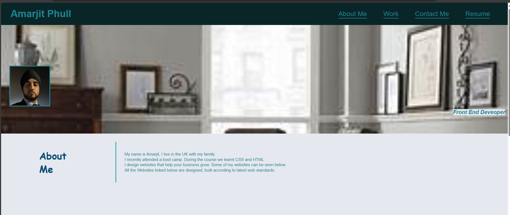

# my profile

## Description

Provide a short description explaining the what, why, and how of your project. Use the following questions as a guide:

- What was your motivation?
I wanted to showcase my skills and talents to employers.

- Why did you build this project? (Note: the answer is not "Because it was a homework assignment.")
 I wanted to showcase my portfolio 
- What problem does it solve?
I wanted to have a single place for my deployed web applications.

- What did you learn?
I took the starter code and refactored it to meet a certain set of standards or implement flexbox, media queries and CSS variables.. 

## Table of Contents (Optional)

If your README is long, add a table of contents to make it easy for users to find what they need.

- [Installation](#installation)
- [Usage](#usage)
- [Credits](#credits)
- [License](#license)

## Installation

What are the steps required to install your project? Provide a step-by-step description of how to get the development environment running.
go to the links below and left click to enter any of the sites.

The deployed website linked above was deployed using GitHub Pages.

## Usage

Once deployed the application can be viewed in a traditional desktop web browser. 

https://p11ull.github.io/myprofile/

https://github.com/p11ull/myprofile

## Credits

Collaborators on this project included instructional staff.

I followed tutorials
https://coding-boot-camp.github.io/full-stack/github/professional-readme-guide.
https://www.w3schools.com/css/css3_flexbox_items.asp
https://www.youtube.com/watch?v=wRNinF7YQqQ

## License

MIT License

## Badges

[Badge] https://img.shields.io/badge/just%20the%20message-8A2BE2

## Features

Links to sections about me, my work and how to contact me (details are fictional)

Links scroll to the corresponding section

First image is larger

When image is clicked you are taken to the deployed application

When the page is resized or viewed on various screens and devices then the layout is responsive and adapts to the viewport

## How to Contribute

If you created an application or package and would like other developers to contribute it, you can include guidelines for how to do so. The [Contributor Covenant](https://www.contributor-covenant.org/) is an industry standard, but you can always write your own if you'd prefer.

## Tests

Tests to ensure the code works were conducted on google chrome.
open the webpage. click refresh.
